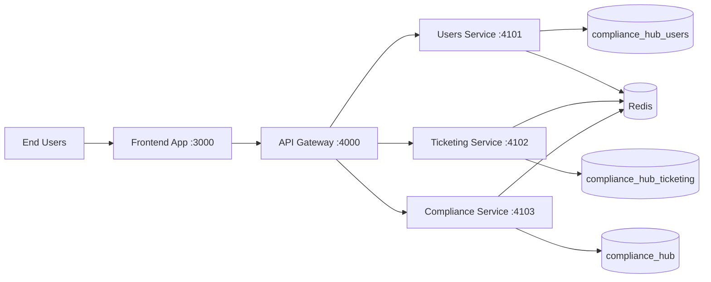
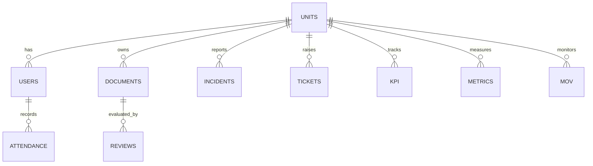

# Compliance Hub Main System Documentation

## 1. Introduction
Compliance Hub is an internal enterprise web platform for compliance operations, ticketing, document governance, KPI monitoring, and cybersecurity-related workflows.

Primary goals:
- Centralize compliance and operational records
- Enforce role/unit-based access control
- Provide actionable dashboards and auditable workflows
- Support microservice-oriented deployment from a shared codebase

## 2. Context Diagram


## 3. System Profile
- Frontend: React + Vite (TypeScript)
- Backend: NestJS + TypeORM (TypeScript)
- Database: MariaDB/MySQL
- Cache/Queue Support: Redis
- Runtime: Docker Compose with split microservices profile

Service roles:
- users-service: authentication, user domain operations
- ticketing-service: tickets and incident-facing operations
- compliance-service: documents, reviews, MOV, KPI/metrics/compliance records
- api-gateway: unified API surface and cross-service health/routing

## 4. Specifications

### 4.1 Minimum and Recommended Server Specifications
| Tier | vCPU | RAM | Storage | Notes |
|---|---:|---:|---:|---|
| Minimum (current feature set) | 4 | 8 GB | 120 GB SSD | Suitable for internal low-moderate load |
| Recommended (production) | 8 | 16 GB | 250 GB SSD/NVMe | Better concurrency and growth headroom |

### 4.2 Software Requirements
- Docker Engine 24+
- Docker Compose plugin 2+
- Git
- Optional: Node.js 20+ for host-side local build/test workflows

### 4.3 Network Requirements
- Open: 3000, 4000, 4101, 4102, 4103, 3306, 6379
- Internal-only access is recommended for DB and Redis ports

## 5. Database Dictionary (High-Level)

### 5.1 Databases
- `compliance_hub_users`: users domain ownership
- `compliance_hub_ticketing`: ticketing domain ownership
- `compliance_hub`: compliance/domain entities (including units)

### 5.2 Core Domain Tables (Representative)
- Users Domain:
  - `users`
  - `attendance`
- Ticketing Domain:
  - `tickets` (and related ticket lifecycle entities)
- Compliance Domain:
  - `units`
  - `documents`
  - `reviews`
  - `incidents`
  - `metrics`
  - `kpi`
  - `mov`
  - `references`
  - `cybersecurity` entities

### 5.3 Ownership Rules
- `users` table is owned by `compliance_hub_users`.
- `units` table is owned by `compliance_hub`.
- `attendance` table is owned by `compliance_hub_users`.

Compatibility views are used where needed to preserve read behavior across bounded contexts.

## 6. ERD / Schema Overview


Note: This ERD is a conceptual map aligned to implemented modules. Physical schema details are in SQL under `backend/database/`.

## 7. User Roles and Permissions

### 7.1 Role Descriptions

#### super_admin (System Administrator)
Full system access with no restrictions:
- Create, edit, deactivate, and manage all user accounts
- Assign users to units and roles
- Create, edit, and delete reportorial document type assignments
- Manage KPI master definitions, thresholds, and scoring rules
- Access all modules: Documents, Reviews, Tickets, Issuances, KPI, MOV, Metrics, Incidents, Cybersecurity
- Manage system Role Definitions
- Provision focal user accounts with extended profile fields
- Full ticket management including assignment, escalation, and closure
- Return documents to focal users with mandatory remarks
- Link and unlink documents to issuances

#### reviewer (Compliance Reviewer / Section Head)
Document governance and review operations:
- Upload documents to assigned units
- Review documents: set compliant, non-compliant, or needs_revision outcomes
- Rate reviews (1–5 stars) and provide comments
- Manage issuances (add, edit, link/unlink to documents)
- Manage metric templates (create, edit, delete)
- Monitor KPI dashboards (all units)
- View and manage compliance metrics
- Resolve and close tickets
- Cannot manage user accounts
- Cannot access system administration settings

#### focal (Unit Focal Person / ITO)
Document submission and unit-level operations:
- Upload documents for their assigned unit
- View and download documents within assigned unit scope
- Submit KPI monitoring data
- View unit KPI dashboard
- Create tickets and view their own submissions
- Cannot perform reviews or approve documents
- Cannot manage metric templates
- Cannot create or edit user accounts

#### technician / technician_desktop / technician_it_support (Support Technicians)
Ticketing and attendance-related operations:
- View and act on tickets assigned to them
- Update ticket status and add resolution notes
- View attendance records for their group
- Limited access to compliance modules
- Cannot manage documents, reviews, or KPI configurations

#### user (Regular Requestor / End User)
Self-service ticketing only:
- Create and view their own tickets
- Rate resolved tickets (satisfaction feedback)
- Cannot access compliance or document modules
- Cannot manage any system records

### 7.2 Module Access Matrix

| Module | super_admin | reviewer | focal | technician | user |
|---|:---:|:---:|:---:|:---:|:---:|
| Dashboard | Full | Full | Unit-scoped | Limited | Tickets only |
| Documents | Full | Read/Upload | Upload (unit) | None | None |
| Reviews | Full | Full | View own | None | None |
| Issuances | Full | Full (CRUD) | Read-only | None | None |
| Tickets | Full | Manage | Create/View own | Assigned only | Create/View own |
| KPI Master | Full | Full | None | None | None |
| KPI Monitoring | Full | Full | Enter for unit | None | None |
| KPI Dashboard | All units | All units | Own unit | None | None |
| MOV Builder | Full | Full | None | None | None |
| Metrics Templates | Full | Full | None | None | None |
| Incidents | Full | Full | View | None | None |
| Cybersecurity | Full | Full | View | None | None |
| Units Admin | Full | Read-only | None | None | None |
| User Management | Full | None | None | None | None |
| Settings | Full | Theme/Password | Theme/Password | Theme/Password | None |

## 8. User Operations Guide

### 8.1 Getting Started

**First Access:**
1. Open a web browser (Chrome, Firefox, Edge, or Safari).
2. Navigate to the application URL (default local: `http://localhost:3000`).
3. Enter credentials on the login screen and click Sign In.
4. Default development seed credentials: username `admin@rictms.gov.ph`, password `password123`. Change immediately on production.

**Session Behavior:**
- Sessions are valid for 30 minutes of activity.
- After 15 minutes of inactivity, the frontend locks and requires password re-entry (local accounts) or Google sign-in again (Google-authenticated accounts).
- Logout clears all local tokens and session state.

### 8.2 Documents Module

**Uploading a Document:**
1. Navigate to Dashboard → Documents.
2. Click Upload Document.
3. Select the unit (auto-filled for focal users).
4. Select the reportorial document type from the unit-assigned list. The expected filename format will be shown.
5. Choose the file (PDF or DOCX).
6. Submit. The document enters `pending` status and metrics processing begins automatically.

**Document Statuses:**
| Status | Meaning |
|---|---|
| `pending` | Uploaded, awaiting review or metric evaluation |
| `needs_revision` | Returned to focal with remarks; requires correction and re-upload |
| `ready` | Passed all automated checks and review steps; compliant output |
| `archived` | Removed from active queue; preserved in archive tab for history |

**Document Repository:**
The Repository view shows all `ready` / compliant documents organized by Year → Month/Quarter/Annual folder structure.
Users can view and download from the repository without leaving the page (inline modal preview).

### 8.3 Reviews Module

Reviews are triggered after a document reaches `ready` state from automated metrics or manual assessment:
1. Navigate to Dashboard → Reviews.
2. Click Review on a document in the review queue.
3. The inline digital viewer loads the document for side-by-side decision tagging.
4. Select outcome: Compliant, Non-Compliant, or Needs Revision.
5. Add a rating (1–5 stars) and optional comment.
6. Submit. The outcome updates the document workflow status:
   - `compliant` → document marked `ready`
   - `non_compliant` / `needs_revision` → document returned to `pending`

### 8.4 KPI Module

**KPI Master (admin/reviewer only):**
- Defines KPI codes, names, target values, frequency (monthly/quarterly/semestral/annual), and whether lower is better.
- Linked to a specific unit and scored using configurable band thresholds.

**KPI Monitoring (admin/reviewer/focal):**
- Enter actual KPI values for a selected unit, period, and frequency.
- Submitted values are stored as `draft` and can be `locked` for period closure.

**KPI Dashboard:**
- Shows Overall Score card, Unit KPI Scores multi-line chart, Unit Detail drill-down panel, and Band Distribution pie chart.
- Focal users see only their own unit. Reviewer and super_admin see all units.
- Period frequency selector: Monthly / Quarterly / Semestral / Annual.

### 8.5 Tickets Module

**Creating a Ticket (any role):**
1. Navigate to Dashboard → Tickets.
2. Click New Ticket.
3. Select Support Type (Desktop Support / IT Support), Subject, Description, Priority.
4. Submit. A ticket number in the format `TKT-YYYY-NNNN` is assigned.

**Ticket Lifecycle:**
| Status | Meaning |
|---|---|
| `open` | Created, awaiting assignment |
| `assigned` | Technician assigned |
| `in_progress` | Technician actively working |
| `resolved` | Technician marked resolved; requester can rate |
| `closed` | Confirmed resolved and archived |

**Satisfaction Rating:**
After a ticket is resolved, the requester can rate the resolution (star rating). While unrated resolved tickets exist, a reminder appears on the Dashboard.

### 8.6 MOV (Measure of Value) Builder

The MOV Builder generates formatted compliance reports:
1. Navigate to Dashboard → MoV.
2. Select a register type and configure report parameters (period, header, footer, signature block).
3. Signature block auto-fills from your logged-in user profile (name, position, designation).
4. Preview the report and use Print/PDF export for official output.
5. Save configurations as presets for reuse.

### 8.7 Issuances Module

Issuances are managed regulatory references (laws, executive orders, circulars, memoranda, standards):
- Compliance and super_admin roles can add, edit, and link/unlink documents to issuances.
- Each issuance has applicability scope, relevance notes, and optional file attachment.
- Title-click behavior: opens source URL if present; otherwise opens the attached file inline.
- Filters: Authority, Category (multi-select), and Status (Active/Inactive).

### 8.8 Cybersecurity and Incidents

**Incidents:**
- Tracks start-of-day (8:00 AM) and end-of-day (5:00 PM) incident snapshots in the Asia/Manila timezone.
- Severity levels: `low`, `medium`, `high`, `critical`.
- Period rollups: daily, weekly, monthly, quarterly, yearly.

**Cybersecurity:**
- Stores cybersecurity-related entries with governance and risk context.
- Access is role-gated; viewer-level users see read-only data.

## 9. API Surface Summary

All API routes are served through the API Gateway at port `4000`. The gateway routes requests to the appropriate microservice.

### 9.1 Authentication and Users (users-service, port 4101)
| Method | Endpoint | Description |
|---|---|---|
| POST | `/api/auth/login` | Authenticate with email and password, returns access + refresh tokens |
| POST | `/api/auth/refresh` | Exchange refresh token for new access token |
| POST | `/api/auth/logout` | Invalidate tokens and clear session |
| GET | `/api/auth/me` | Get current authenticated user profile including `authProvider` |
| POST | `/api/auth/reauthenticate` | Re-verify password for inactivity unlock (local accounts only) |
| GET | `/api/users` | List all users (admin) |
| POST | `/api/users` | Create a new user account |
| PATCH | `/api/users/:id` | Update user account fields |
| GET | `/api/users/federated` | Return users with unit context (cross-DB compatible) |
| GET | `/api/units` | List all organizational units |
| POST | `/api/units` | Create a unit |
| PATCH | `/api/units/:id` | Update a unit |
| GET | `/api/attendance` | List attendance records |
| POST | `/api/attendance` | Record attendance entry |
| GET | `/api/health` (gateway) | Returns service availability for users, ticketing, compliance |

### 9.2 Ticketing (ticketing-service, port 4102)
| Method | Endpoint | Description |
|---|---|---|
| GET | `/api/tickets` | List tickets (scope depends on role) |
| POST | `/api/tickets` | Create a new ticket |
| GET | `/api/tickets/:id` | Get ticket detail |
| PATCH | `/api/tickets/:id` | Update ticket status, assignment, or notes |
| POST | `/api/tickets/:id/escalate` | Escalate ticket (with optional proof photo upload) |
| POST | `/api/tickets/:id/rate` | Submit satisfaction rating |
| GET | `/api/ticket-settings` | List ticket categories, issue types, priorities |

### 9.3 Compliance (compliance-service, port 4103)
| Method | Endpoint | Description |
|---|---|---|
| GET | `/api/documents` | List documents (role/unit-scoped) |
| POST | `/api/documents` | Upload a new document |
| GET | `/api/documents/:id` | Get document detail with metrics and review status |
| GET | `/api/documents/repository` | Get ready/compliant documents by year/period folder |
| POST | `/api/documents/:id/versions` | Upload a new document version |
| GET | `/api/reviews` | List review records |
| POST | `/api/reviews` | Create a review decision |
| GET | `/api/issuances` | List regulatory issuances |
| POST | `/api/issuances` | Create an issuance record |
| PATCH | `/api/issuances/:id` | Update an issuance |
| GET | `/api/metrics` | List metric templates |
| POST | `/api/metrics` | Create a metric template |
| GET | `/api/kpi/dashboard` | Get aggregated KPI dashboard data |
| GET | `/api/kpi/dashboard/unit/:id/timeseries` | Get per-unit KPI timeseries data |
| GET | `/api/incidents/period-stats` | Get incident period rollup statistics |
| GET | `/api/mov` | Get MOV register data |
| POST | `/api/cybersecurity` | Create cybersecurity record |

## 10. Security and Session Behavior
- JWT-based authentication with access token (short-lived) and refresh token (long-lived)
- Role- and unit-based access controls enforced in NestJS backend guards
- 15-minute inactivity lock: after 15 minutes of no user activity, the frontend locks the session
  - Local-auth users must re-enter their password to unlock
  - Google-authenticated users are prompted to sign in again
- Password re-authentication endpoint (`POST /auth/reauthenticate`) verifies credentials without a full logout/login cycle
- `passwordHash` is excluded from all API responses via global `ClassSerializerInterceptor`
- API rate limiting is applied at the gateway level to prevent abuse
- CORS is restricted to the configured `CORS_ORIGIN` environment variable
- JWT tokens include issuer and audience claims; tampered tokens are rejected by the JWT strategy

## 11. Deployment Quick Reference

The application runs as a set of Docker Compose containers. The split microservices runtime uses the `microservices` profile.

**Minimum deployment sequence:**
1. Start data services: `docker compose --profile microservices up -d mariadb redis`
2. Confirm MariaDB and Redis health: `docker compose ps`
3. Run database migration (first-time only):
   ```bash
   docker exec -i ricms_mariadb mysql -uroot -pricms_password < backend/database/microservices-migrate.sql
   ```
4. Start backend services: `docker compose --profile microservices up -d users-service ticketing-service compliance-service api-gateway`
5. Start frontend: `docker compose up -d frontend`
6. Validate gateway health:
   ```bash
   curl http://localhost:4000/api/health
   ```
   Expected response contains `services.users`, `services.ticketing`, and `services.compliance` status flags.
7. Open frontend at `http://<host>:3000` and sign in.

**Required ports:** 3000 (frontend), 4000 (gateway), 4101 (users), 4102 (ticketing), 4103 (compliance), 3306 (MariaDB), 6379 (Redis).

**Rollback procedure:** Stop all containers (`docker compose --profile microservices down`), restore database from backup, checkout previous commit, rebuild and redeploy.

## 12. Web App Access
- Default local development URL: `http://localhost:3000`
- For intranet or production deployment, map the frontend service (port 3000) and the gateway (port 4000) behind your organization's DNS entry or reverse proxy.
- The API gateway health check endpoint (`http://<host>:4000/api/health`) can be used for external health monitoring and uptime checks.
