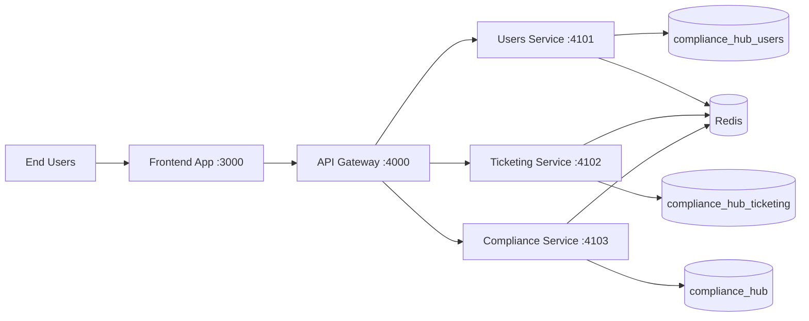
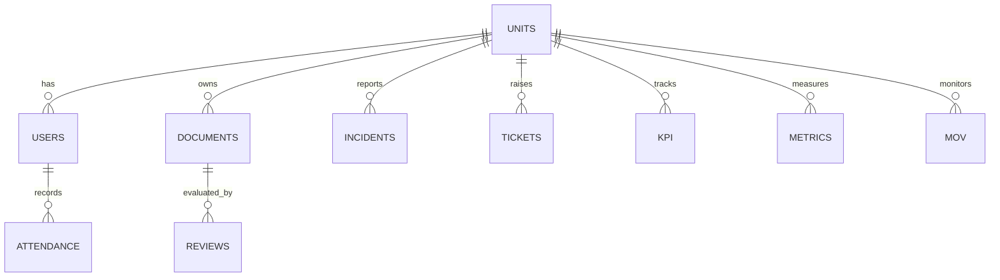

# Compliance Hub Main System Documentation

## 1. Introduction
Compliance Hub is an internal enterprise web platform for compliance operations, ticketing, document governance, KPI monitoring, and cybersecurity-related workflows.

Primary goals:
- Centralize compliance and operational records
- Enforce role/unit-based access control
- Provide actionable dashboards and auditable workflows
- Support microservice-oriented deployment from a shared codebase

## 2. Context Diagram

## 3. System Profile
- Frontend: React + Vite (TypeScript)
- Backend: NestJS + TypeORM (TypeScript)
- Database: MariaDB/MySQL
- Cache/Queue Support: Redis
- Runtime: Docker Compose with split microservices profile

Service roles:
- users-service: authentication, user domain operations
- ticketing-service: tickets and incident-facing operations
- compliance-service: documents, reviews, MOV, KPI/metrics/compliance records
- api-gateway: unified API surface and cross-service health/routing

## 4. Specifications

### 4.1 Minimum and Recommended Server Specifications
| Tier | vCPU | RAM | Storage | Notes |
|---|---:|---:|---:|---|
| Minimum (current feature set) | 4 | 8 GB | 120 GB SSD | Suitable for internal low-moderate load |
| Recommended (production) | 8 | 16 GB | 250 GB SSD/NVMe | Better concurrency and growth headroom |

### 4.2 Software Requirements
- Docker Engine 24+
- Docker Compose plugin 2+
- Git
- Optional: Node.js 20+ for host-side local build/test workflows

### 4.3 Network Requirements
- Open: 3000, 4000, 4101, 4102, 4103, 3306, 6379
- Internal-only access is recommended for DB and Redis ports

## 5. Database Dictionary (High-Level)

### 5.1 Databases
- `compliance_hub_users`: users domain ownership
- `compliance_hub_ticketing`: ticketing domain ownership
- `compliance_hub`: compliance/domain entities (including units)

### 5.2 Core Domain Tables (Representative)
- Users Domain:
  - `users`
  - `attendance`
- Ticketing Domain:
  - `tickets` (and related ticket lifecycle entities)
- Compliance Domain:
  - `units`
  - `documents`
  - `reviews`
  - `incidents`
  - `metrics`
  - `kpi`
  - `mov`
  - `references`
  - `cybersecurity` entities

### 5.3 Ownership Rules
- `users` table is owned by `compliance_hub_users`.
- `units` table is owned by `compliance_hub`.
- `attendance` table is owned by `compliance_hub_users`.

Compatibility views are used where needed to preserve read behavior across bounded contexts.

## 6. ERD / Schema Overview

Note: This ERD is a conceptual map aligned to implemented modules. Physical schema details are in SQL under `backend/database/`.

## 7. User and Operations Manuals
Available manuals and walkthroughs in repository root:
- `QA-USER-MANUAL.md`
- `WALKTHROUGH.md`
- `SETUP.md`
- `INSTALLATION.md`
- `DATABASE-SETUP-COMPLETE.md`

## 8. Security and Session Behavior
- JWT-based authentication with refresh token support
- Role- and unit-based access controls in backend guards
- 15-minute inactivity lock in frontend session context
- Password re-authentication endpoint for local-auth users
- Google-auth users are required to sign in again when inactivity lock triggers

## 9. Deployment Reference
Use `deployment.md` for full step-by-step deployment and split container setup.

## 10. Web App Link
- Default local URL: `http://localhost:3000`
- Intranet/production URL should map this frontend service behind your organization DNS/reverse-proxy policy.
